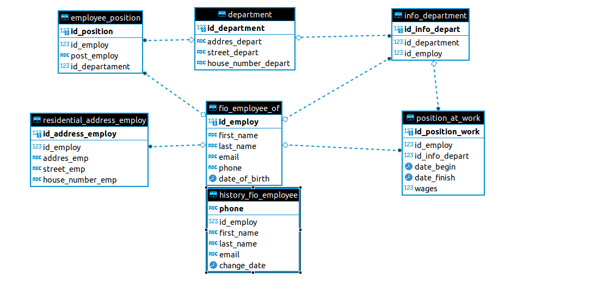
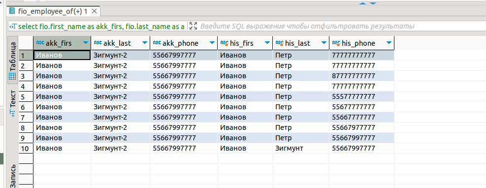
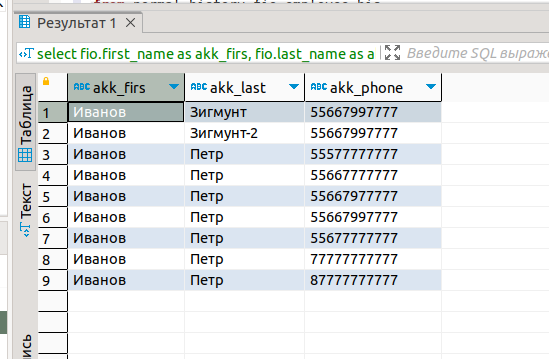

# Зависимости. Нормализация. Денормализация

## 1-3
Результат работы можно посмотреть на скрине 

Так же во вложении есть скрипт создания данных таблиц [sql.sql](./sql.sql)

Создание таблицы для исторических данных:

    CREATE TABLE history_fio_employee (
        id_employ     bigint,
        first_name    varchar(40) NOT NULL,
        last_name     varchar(40) NOT NULL,
        email         varchar(40),
        phone         varchar(11),
        change_date   date not null
    );

Убрана дата рождения, и добавленно поле change data

## 4
В данной тригеррной функции я использовал только insert без обновления данных, так как мы должны хранить всю историю всех изменений которые происходят в основной таблице. 

    create OR replace trigger SCD4_fio
    after update on normal.fio_employee_of
    FOR EACH row
    execute  function saving_changes();

    create OR REPLACE FUNCTION saving_changes() RETURNS trigger as $$
    begin 
        if (TG_OP = 'UPDATE') then 
        insert into normal.history_fio_employee values (old.id_employ, old.first_name, old.last_name, old.email, old.phone, now());
        end if;
    return new;
    end;
    $$ LANGUAGE plpgsql;

Результат на скрине

Запросы чтоб разместить 2 таблицы и сравнить значения до и после

    select fio.first_name as akk_firs, fio.last_name as akk_last, fio.phone as akk_phone,
    his.first_name as his_firs, his.last_name as his_last, his.phone as his_phone
    from normal.fio_employee_of fio , normal.history_fio_employee his where fio.id_employ  =3;

result 

    select fio.first_name as akk_firs, fio.last_name as akk_last, fio.phone as akk_phone 
    from normal.fio_employee_of fio 
    where fio.id_employ  =3 union select all his.first_name as his_firs, his.last_name as his_last, his.phone as his_phone
    from normal.history_fio_employee his
    where his.id_employ  =3

result