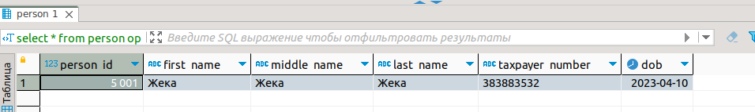
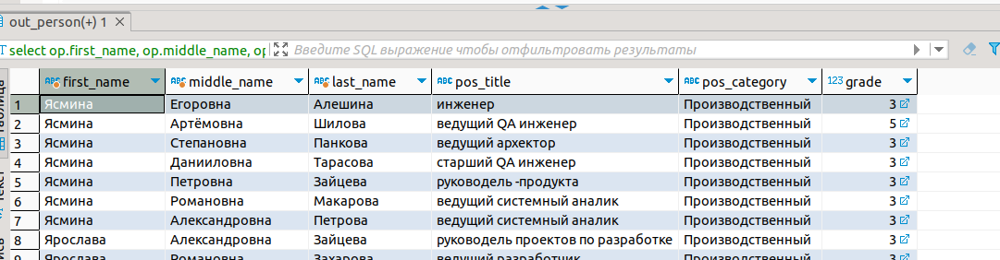
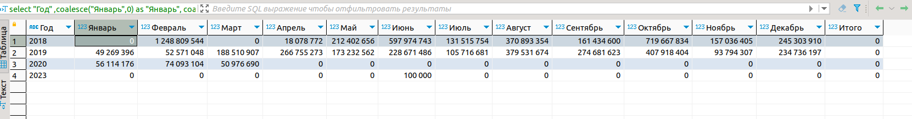
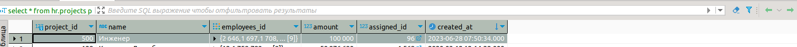
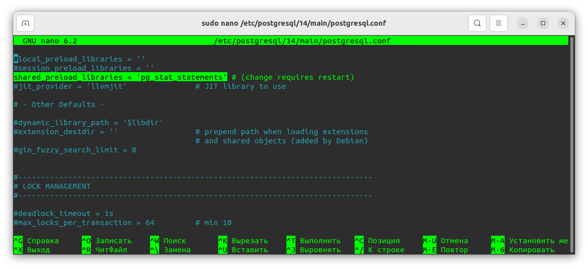
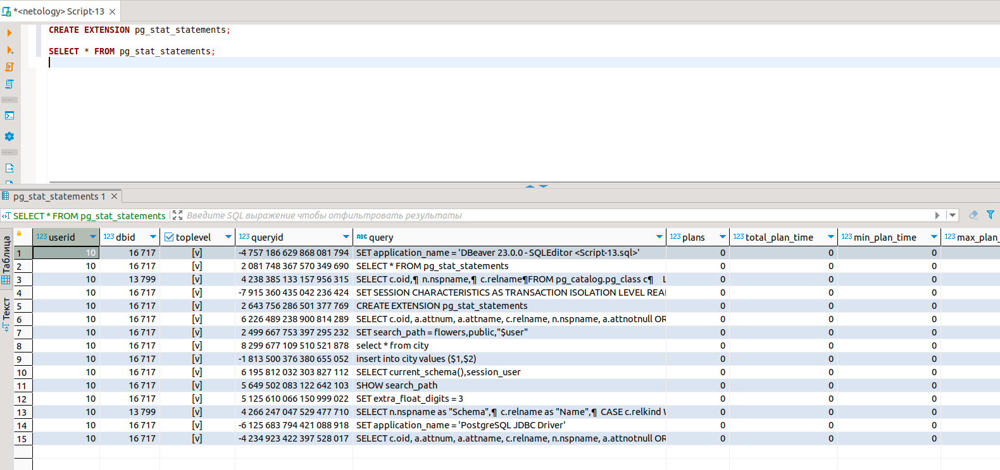

# PostgreSQL Extensions
## 1.
### postgres_fdw

Расширение позволяет обращаться к внешним СУБД, файлам и веб-сервисам:

- Можно получать данные из нескольких баз, не используя сторонние инструменты.
- Пригодится для шардинга, где нужно поделить одну большую базу данных на несколько инстансов в вертикальной или горизонтальной логике.
- Поможет провести бесшовную миграцию с одной базы данных на другую или объединить несколько БД.
- Готовые FDW (foreign-data wrappers) есть у MySQL, Redis, MongoDB, ClickHouse, Kafka и других СУБД. 

Делаем отдельную бд для тестирвоания

    create database test;

Создаём таблицу 

    CREATE  table public.person (
        person_id       bigserial primary key,
        first_name      varchar(250),
        middle_name     varchar(250),
        last_name       varchar(250),
        taxpayer_number varchar(40),
        dob             date default now())

Проверяем установленные модули в моем экземпляре postgreSQL на основной базе данных

    select *
    from pg_catalog.pg_available_extensions 
    where installed_version is not null 

Вывод

    plpgsql	1.0	1.0	PL/pgSQL procedural language
    postgres_fdw	1.1	1.1	foreign-data wrapper for remote PostgreSQL servers

Для установки postgres_fdw	потребуется команда

    create extension postgres_fdw 

Далее создаем server для настройки соединения между базами данных на основном сервере 

    create server pfdw_test
    foreign data wrapper postgres_fdw --какую обертку будем использовать
    options (host '127.0.0.1', port '5433', dbname 'test') 

Далее указываем какую учетную запись будем использовать для подключения

    create user mapping for postgres 
    server pfdw_test
    options (user 'postgres', password 'example')

Далее необходимо создать аналогичную таблицу, к которой мы подключимся и продублируем данные, сразу пролписываем зависимости от server схемы данных и именни таблицы.

    CREATE foreign table out_person (
        person_id       int4,
        first_name      varchar(250) ,
        middle_name     varchar(250),
        last_name       varchar(250),
        taxpayer_number varchar(40),
        dob             date default now())
    server pfdw_test
    options (schema_name 'public', table_name 'person') 

Тут прописываем зависимости от таблицы и сервера что создали ранее 

Далее проверяем 

    insert into  out_person values(5001,'Жека','Жека','Жека','383883532',now())

Далее заполняем данными которые были в таблицы person

    select op.first_name, op.middle_name, op.last_name, p.pos_title, p.pos_category, p.grade 
    from hr.out_person op
    join hr.employee em on em.person_id=op.person_id
    join hr."position" p on em.pos_id=p.pos_id
    where p.grade is not null
    order by  op.first_name desc

## 2.
с помощью модуля tablefunc получите из таблицы projects базы HR таблицу с данными.
Данный запрос вызвал определннеы сложности у меня. По итогу фильнального результата получить не удалось
ссылка для сравнения https://letsdocode.ru/sql-main/sqlp-5-2.png

    select "Год"
        ,coalesce("Январь",0) as "Январь", coalesce("Февраль",0) as "Февраль" 
        ,coalesce("Март",0) as "Март",     coalesce("Апрель",0) as "Апрель"  
        ,coalesce("Май",0) as "Май",       coalesce("Июнь",0) as "Июнь",         coalesce("Июль",0) as "Июль" 
        ,coalesce("Август",0) as "Август" ,coalesce("Сентябрь",0) as "Сентябрь", coalesce("Октябрь",0) as "Октябрь"
        ,coalesce("Ноябрь",0) as "Ноябрь" ,coalesce("Декабрь",0) as "Декабрь",   coalesce("Итого", 0) as "Итого"
    from crosstab
    ($$ select *
        from (select to_char(p.created_at, 'YYYY')::text as ye,
            extract(month from p.created_at)::text as mon,
            sum(p.amount) as s
            from projects p
            group by ye, mon
            order by ye, mon) t  
        $$, $$ select mont::text from (
            select distinct extract(month from p.created_at) mont
            from projects p 
            order by mont)  as "text"
            union all
            select 'Итого'::text
            $$ ) as cst("Год" text , "Январь" NUMERIC ,"Февраль" numeric ,"Март"numeric ,"Апрель" numeric ,"Май" numeric ,"Июнь"numeric ,"Июль"numeric 
        ,"Август" numeric ,"Сентябрь" numeric ,"Октябрь" numeric ,"Ноябрь" numeric ,"Декабрь" numeric, "Итого" numeric);	 

результат 
! Я ранее добавил запись в 2023 год. 

## 3.
pg_stat_statements
вкелючить

    CREATE EXTENSION pg_stat_statements;

    SELECT * FROM pg_stat_statements;

