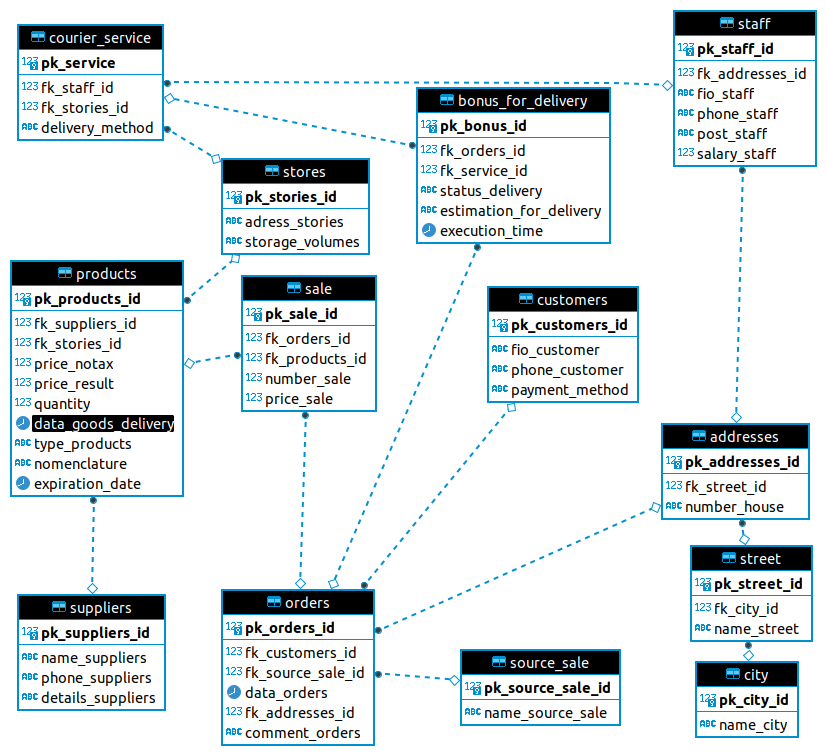

# Концептуальная схема данных. Доставка цветов.

Сущности:
1. suppliers - поставщики. 
2. stores - склады. 
3. customers - клиенты.
4. staff - сотрудники.
5. products - товар. 
6. source_sale - источники продаж.
7. orders - заказы.
8. city - города
9. street - наименования улиц
10. addresses - адрес( как и работников так и ддоставки цветов)
11. courier_service - курьерская служба
12. bonus_for_delivery - тут пытаемся простимулировать сотрудников курьерской службы, следим за статусом заказа, кому назначен заказ, время исполнения и оценка.
13. sale - самав продажа, тут идёт кол-во и цена проданного товара

Рисунок схемы 

Так же можно посмотреь скрипт для создания [sql code](./sql_create.sql)