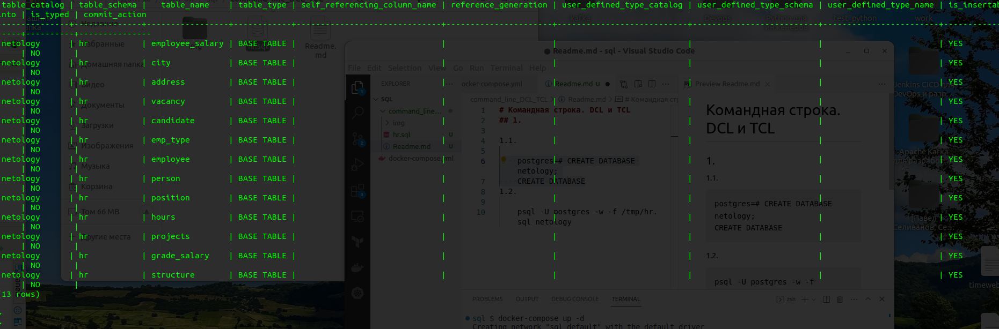
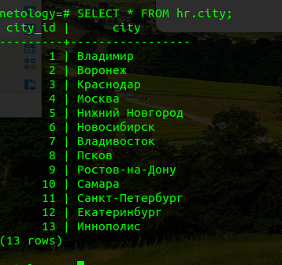
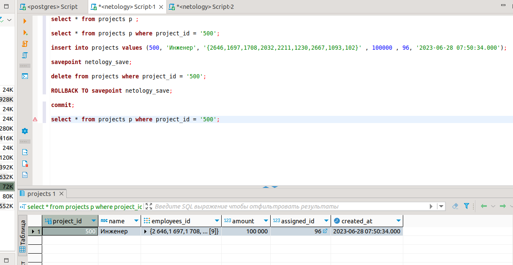

# Командная строка. DCL и TCL
## 1.

1.1.

    postgres=# CREATE DATABASE netology;
    CREATE DATABASE
1.2.

    psql -U postgres -w -f /tmp/hr.sql netology

1.3.

Вывод всех таблиц в консоле psql 
  

1.4. 

 Вывод sql запроса 

    SELECT * FROM hr.city;

 

## 2

Создать пользователя:

    create user	MyUser;

Задать пароль и срок действия:

    alter user MyUser with password 'secret' valid until '31.03.2023';

Даём права на таблицы address, city:

    grant all PRIVILEGES ON table address, city to MyUser;

Заберите право:

    revoke all PRIVILEGES ON table address, city from MyUser;

Удалить пользователь:

    DROP USER MyUser;

## 3

3.1.

Добавьте в таблицу projects новую запись

    insert into projects values (500, 'Инженер', '{2646,1697,1708,2032,2211,1230,2667,1093,102}' , 100000 , 96, '2023-06-28 07:50:34.000');

3.2.

 Создайте точку сохранения

    savepoint netology_save;

3.3.

Удалите строку

    delete from projects where project_id = '500';
3.4. 

Откатитесь к точке сохранения

    ROLLBACK TO savepoint netology_save;

Скрин 