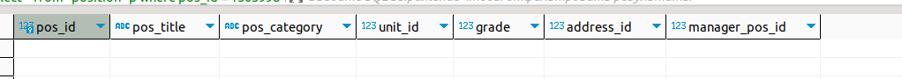
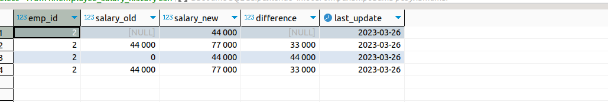

#  "Хранимые процедуры"
## 1

Полный скрипт создания функции можно посмотреть в файлк [sql_script](SQLP-26.2.1.sql)

    create function foo(vac_ text, begin_date date, end_date date) RETURNS int as $$
    declare vac_count integer;
        begin 
        select COUNT(*) into vac_count from vacancy where vac_title =vac_ and create_date > begin_date   and create_date < end_date;  
        return vac_count;
        end;
    $$ LANGUAGE plpgsql;

На вход подаются 3 параметра, название должности, дата начала сортировки и дата окончания сортировки. 

Можно добавить условие на корректность подстановки дат

    create OR REPLACE FUNCTION foo(vac_ text, begin_date date, end_date date) RETURNS int as $$
    declare vac_count integer;
        begin 
        if begin_date > end_date then
          return null;
        else
            select COUNT(*) into vac_count from vacancy where vac_title =vac_ and create_date > begin_date   and create_date < end_date;  
            return vac_count;
        end if;
        end;
    $$ LANGUAGE plpgsql;

## 2

Создаем триггерную функцию которая будет проверять на вхождение таблицу grade_salary иммется ли данная запись в таблицу grade

    create OR REPLACE FUNCTION foo_trigger() RETURNS trigger as $$
    begin 
        if not exists (select grade from grade_salary where grade = new.grade )
        then
            RAISE EXCEPTION 'Grade not valid, please add new grade';
        end if;
    return new;
    end;
    $$ LANGUAGE plpgsql;

Создаем сам триггер который будет обрабатывать действие на insert

    create OR replace trigger add_data
    before  insert or update  on "position"
    FOR EACH row
    when (new.grade IS NOT NULL)
    execute  procedure foo_trigger();

тестирование 

    insert into "position" (pos_id, pos_title, pos_category, unit_id, grade, address_id, manager_pos_id)  
    values (1505998,'Нетолог','Главный',212, 20, 10 ,2)

Результат 

    insert into "position" (pos_id, pos_title, pos_category, unit_id, grade, address_id, manager_pos_id)  
    values (1505997,'Нетолог','Главный',212, 2, 10 ,2)

Результат

    SQL Error [P0001]: ERROR: Grade not valid, please add new grade
    Где: PL/pgSQL function foo_trigger() line 5 at RAISE

test update

    update "position" set pos_category = 'Самый главный', grade = 20 where pos_id = 1505997

Result

    SQL Error [P0001]: ERROR: Grade not valid, please add new grade
    Где: PL/pgSQL function foo_trigger() line 5 at RAISE

## 3.

Пишем триггерную функцию

    create OR REPLACE FUNCTION append_trigger() RETURNS trigger as $$
    declare
    old_ integer;
    diff integer;
    begin 
        if  (TG_OP = 'INSERT') then 
            old_ = '0';
            diff = new.salary ;
            insert into hr.employee_salary_history values (new.emp_id,  old_, new.salary, diff, new.effective_from);
            return new;
        elseif (TG_OP = 'UPDATE') then 
            old_ = old.salary;
            diff = new.salary - old_;
            insert into hr.employee_salary_history values (new.emp_id,  old_, new.salary, diff, new.effective_from);
            return new;
        end if;  
    end;
    $$ LANGUAGE plpgsql;

далее пишем сам триггер на добавлени и обновления данных

    create OR replace trigger append
    before insert or update on hr.employee_salary
    FOR EACH row
    execute  function append_trigger();

Ну и для тестирования я использовал сл sql команды

    update hr.employee_salary set salary = 77000 where order_id =  5501;
    
    insert into hr.employee_salary values (5501, 2, 44000, '26.03.2023');

Результат для тестирования

