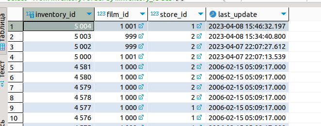
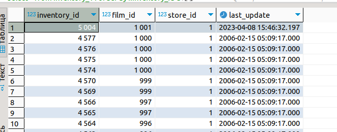
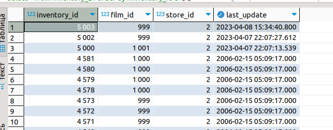
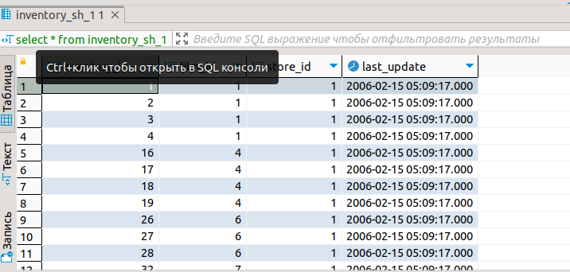

# "Масштабирование"

## 1.
Выполните горизонтальное партиционирование для таблицы inventory учебной базы dvd-rental:
В данном файле приведу список sql команд для выполнения данного заданий.

Сначала необходимо сгенерировать 2 таблицы зависящие от главной таблицы.

    CREATE TABLE inventory_1 (CHECK ( store_id = '1')) INHERITS (inventory);

    CREATE TABLE inventory_2 (CHECK ( store_id = '2')) INHERITS (inventory);

Далее необходимо создать 2 index для основной таблицы и двух зависимых

    CREATE INDEX inv_os on inventory (inventory_id, store_id);

    CREATE INDEX inv_os_1 ON inventory_1 (inventory_id, store_id);

    CREATE INDEX inv_os_2 ON inventory_2 (inventory_id, store_id);

Далее создаём правило для insert

    CREATE RULE new_insert_1 AS ON INSERT TO inventory WHERE ( store_id = '1') DO INSTEAD INSERT INTO inventory_1 VALUES (NEW.*);

    CREATE RULE new_insert_2 AS ON INSERT TO inventory WHERE ( store_id = '2') DO INSTEAD INSERT INTO inventory_2 VALUES (NEW.*);

Названия правила, на какую таблицу оно распространяется, так же условия и далее описываем что мы будем делать, в данном случаее insert новых данных в зависимые таблицы.

Далее необходимо создать правило для обновления данных

    CREATE RULE new_update_1 AS ON UPDATE TO inventory 
    WHERE (( old.store_id = '1') and (new.store_id !='1'))
    DO INSTEAD (INSERT INTO inventory VALUES (NEW.*);
    delete from inventory_1 where inventory_id = new.inventory_id);

    CREATE RULE new_update_2 AS ON UPDATE TO inventory 
    WHERE (( old.store_id = '2') and (new.store_id !='2'))
    DO INSTEAD (INSERT INTO inventory VALUES (NEW.*);
    delete from inventory_2 where inventory_id = new.inventory_id);  

В данном примере мы сверяем, поменялся ли наш store_id и если он поменялся то мы обязанны данную запись удалить из данной зависимой таблицы и отправить ее на новую запись в главную таблицу. Так как правило на insert есть, то главная таблица отправит данные куда необходимо.

Так же можно воспользоваться триггерной функцией написал только на insert

    --insert
    CREATE OR REPLACE FUNCTION new_inventory() 
    RETURNS TRIGGER AS $$
        BEGIN
            IF ( NEW.store_id = '1') then
                INSERT INTO inventory_1 VALUES (NEW.*);
            ELSIF ( NEW.store_id = '2') then
                INSERT INTO inventory_2 VALUES (NEW.*);
    END IF;
    RETURN NULL;
    END;
    $$
    LANGUAGE plpgsql;

    CREATE TRIGGER new_inventory_
    BEFORE INSERT ON inventory
    FOR EACH ROW EXECUTE FUNCTION new_inventory();
    --insert

Достаточно простая, если новая запись содержит store_id = 1 то отправляем на запись в 1 дочерную таблицу, либо во 2.  
Выводы: 
  

## 2.
Создаём таблицы на отдельном сервере

    create TABLE public.inventory_sh_1 (
        inventory_id int NOT NULL,
        film_id int2 NOT NULL,
        store_id int2 NOT null check(store_id=1),
        last_update timestamp NOT NULL DEFAULT now()
    );
    CREATE TABLE public.inventory_sh_2 (
        inventory_id int NOT NULL,
        film_id int2 NOT NULL,
        store_id int2 NOT null check(store_id=2),
        last_update timestamp NOT NULL DEFAULT now()
    );

Подключаем модуль на основной бд 

    CREATE EXTENSION postgres_fdw;
 
 Создаем сервер для покдлючения к нашей базе данных

    CREATE SERVER news_1 FOREIGN DATA WRAPPER postgres_fdw OPTIONS (host '127.0.0.1', dbname 'test_fdw', port '5433'); --extension
 
 Вдруг ошибка в строке подключения -)

    drop server news_1 Cascade

CREATE USER MAPPING определяет сопоставление пользователя с внешним сервером.

    CREATE USER MAPPING FOR postgres SERVER news_1 OPTIONS (user 'postgres', password 'example'); --name server

Далее создаём 2 таблицы с указанием сервера для подключения к нашим таблицам

    CREATE FOREIGN TABLE public.inventory_sh_1 (
        inventory_id int NOT NULL,
        film_id int2 NOT NULL,
        store_id int2 NOT NULL,
        last_update timestamp NOT NULL DEFAULT now()
    )
    SERVER news_1
    OPTIONS (schema_name 'public', table_name 'inventory_1');
    CREATE FOREIGN table

Вторая таблица 

    CREATE FOREIGN TABLE public.inventory_sh_2 (
        inventory_id int NOT NULL,
        film_id int2 NOT NULL,
        store_id int2 NOT NULL,
        last_update timestamp NOT NULL DEFAULT now()
    )
    SERVER news_1
    OPTIONS (schema_name 'public', table_name 'inventory_2');
    CREATE FOREIGN table

Результат 

Есть похожая работа у меня https://github.com/MikhailShapovalov26/DBPostgres_shard